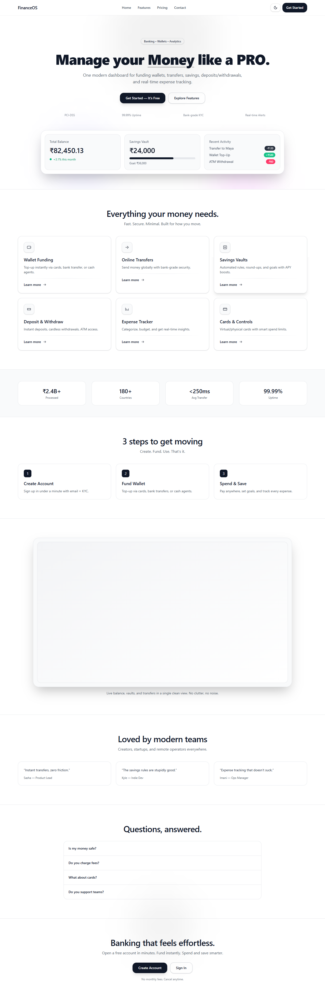
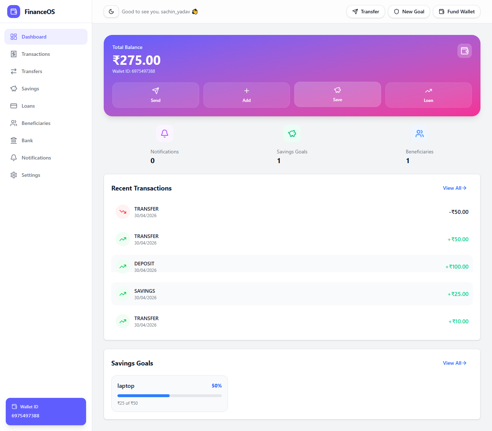
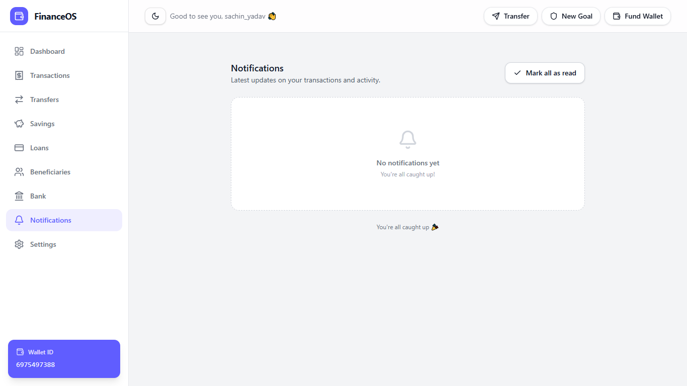
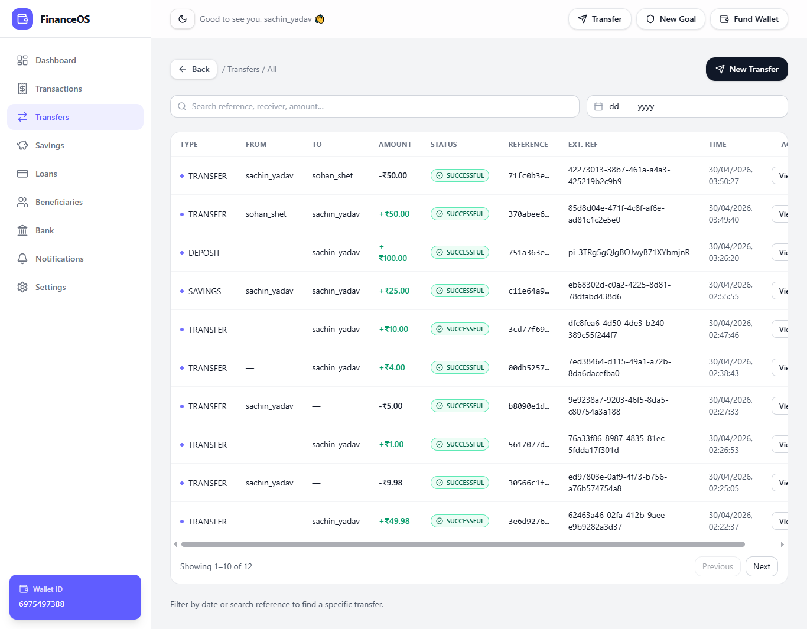
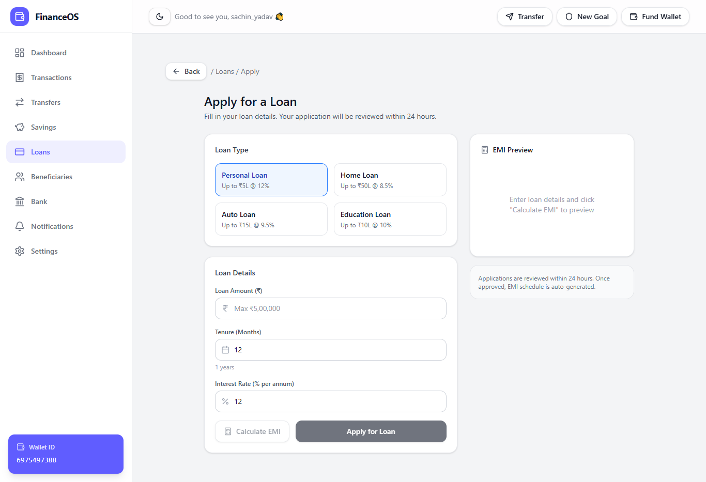

# Fintech Bank / Digital Wallet

A modern fintech digital wallet application built with **Django (REST Framework)** and **React (Vite + Tailwind CSS)**. This project features secure user authentication, transaction management, Stripe integration, and an interactive dashboard.

## 🚀 Key Features

- **User Authentication**: Secure signup/login with JWT (SimpleJWT) and HttpOnly cookies.
- **OTP Verification**: Multi-channel OTP (Email/SMS) for secure registration and transactions.
- **Digital Wallet**: Fund transfers, transaction history, and balance management.
- **Stripe Integration**: Secure payment processing for adding funds.
- **Transaction PIN**: Secure 4-digit PIN for sensitive operations.
- **Admin Dashboard**: Enhanced admin interface using Django Jazzmin.
- **Modern UI**: Fully responsive frontend built with React, Vite, and Tailwind CSS.

---

## 📁 Project Structure

```text
Fintech_Bank/
├── backend/            # Django REST API
│   ├── core/           # Core banking logic & transactions
│   ├── userauths/      # Custom User model & Authentication
│   ├── backend/        # Main project configuration (settings, urls)
│   └── manage.py       # Django CLI
├── frontend/           # React + Vite application
│   ├── src/            # Components, pages, hooks, state
│   ├── public/         # Static assets
│   └── index.html      # Main entry point
├── images/             # Project screenshots
└── README.md           # This file
```

---

## 🛠️ Getting Started

### 1. Prerequisites
- **Python 3.8+**
- **Node.js (LTS)**
- **npm** or **yarn**

### 2. Backend Setup
1. Navigate to the backend directory:
   ```bash
   cd backend
   ```
2. Create and activate a virtual environment:
   ```bash
   python -m venv venv
   # Windows:
   venv\Scripts\activate
   # macOS/Linux:
   source venv/bin/activate
   ```
3. Install dependencies:
   ```bash
   pip install -r requirements.txt
   ```
4. Configure environment variables:
   - Create a `.env` file based on `.env.example`.
5. Run migrations and start the server:
   ```bash
   python manage.py migrate
   python manage.py runserver
   ```

### 3. Frontend Setup
1. Navigate to the frontend directory:
   ```bash
   cd frontend
   ```
2. Install dependencies:
   ```bash
   npm install
   ```
3. Configure environment variables:
   - Create a `.env` file (e.g., `VITE_API_URL=http://127.0.0.1:8000/api/v1/`).
4. Start the development server:
   ```bash
   npm run dev
   ```

---

## 🛡️ Security
- **JWT Auth**: Access tokens stored in state, refresh tokens in HttpOnly cookies.
- **CORS/CSRF**: Configured to protect against cross-site attacks.
- **Input Validation**: Strict validation for transactions and user data.

## 💳 Payment Integration
- Uses **Stripe** for secure payment processing.
- Webhook support for real-time transaction updates (Optional/Planned).

## 📄 License
This project is for educational purposes.

---

## 📸 Screenshots

### Authentication
| Signup | Login | Login Email |
| :---: | :---: | :---: |
|  |  |  |

### Dashboard & Overview
| Overview | Dashboard | Notifications |
| :---: | :---: | :---: |
|  |  |  |

### Banking & Transactions
| Bank Page | Transactions | Transfers |
| :---: | :---: | :---: |
|  |  |  |

### Beneficiaries
| Beneficiaries List | Add Beneficiary |
| :---: | :---: |
|  |  |

### Goals
| Goals Overview | Create New Goal |
| :---: | :---: |
|  |  |

### Loans & Profile
| Loan Application | Loan Details | Profile |
| :---: | :---: | :---: |
|  |  |  |
